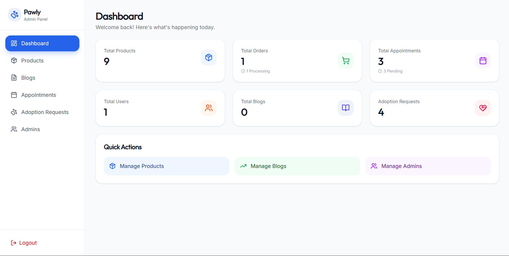
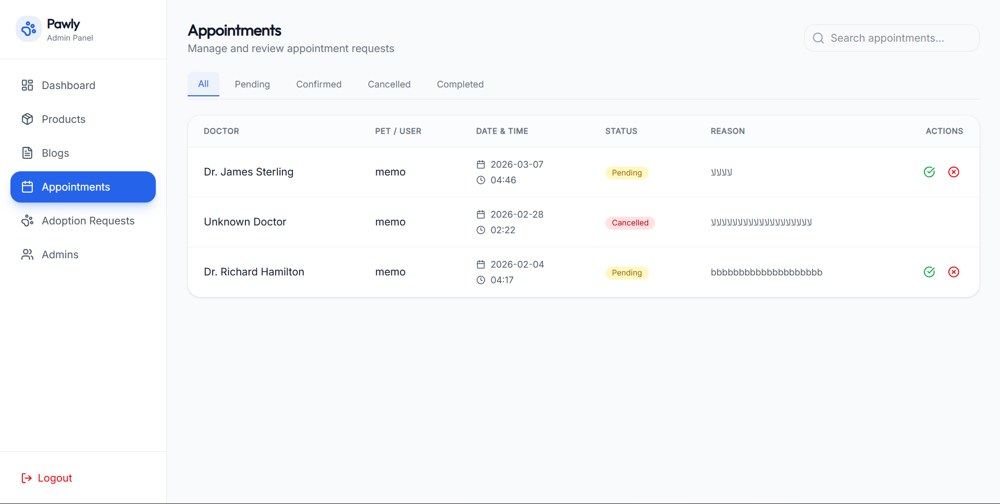
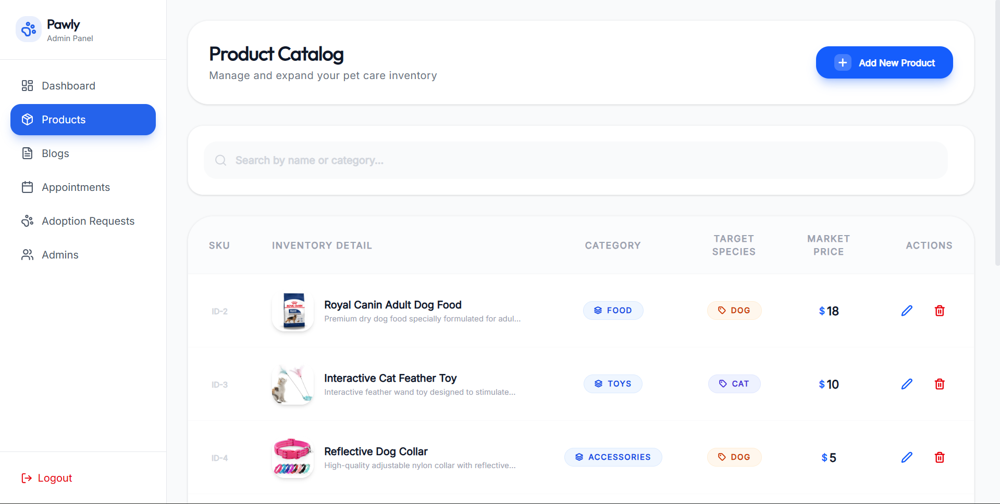

# 🐾 Pawly Petcare - Unified Adoption & Veterinary Platform

**A modern, scalable microservices-inspired platform bridging the gap between shelters, veterinarians, and pet lovers.**

[Live Demo](https://pawly-petcare.vercel.app/) • [Documentation](PROJECT_STRUCTURE.md) • [Report Bug](https://github.com/muhamedessamz/pawly-petcare/issues)

---

## 📋 Table of Contents

- [Project Overview](#-project-overview)
- [Architecture](#-architecture)
- [Repositories](#-repositories)

## 🚀 Executive Summary

**Pawly Petcare** addresses the fragmented nature of pet adoption and veterinary services. Traditional adoption processes are often manual and slow, while veterinary clinics struggle with digital appointment management.

**This solution provides:**
1.  **Centralized Pet Database**: Real-time tracking of available pets across multiple shelters.
2.  **Digital Adoption Workflow**: A fully automated application process with admin oversight.
3.  **Veterinary Integration**: Seamless appointment booking with verified doctors.
4.  **E-Commerce Capabilities**: Integrated shop for pet essentials, creating a sustainable revenue model.

---

## 🧠 Technical Architecture

The system is architected for **Scalability**, **Maintainability**, and **Security**.

### 🔹 Backend: Use of Clean Architecture
The core API is built on **Clean Architecture (Onion Architecture)** principles to ensure independence of frameworks and UI.

-   **Domain Layer**: Pure C# entities and business rules (Zero dependencies).
-   **Application Layer**: Use Cases, DTOs, and Interfaces (CQRS pattern ready).
-   **Infrastructure Layer**: EF Core implementation, Database migrations, and external services.
-   **Presentation Layer (API)**: Minimal controllers handling HTTP requests.

### 🔹 Frontend: Modern React Ecosystem
Two separate, optimized React applications:
-   **Main Website**: focused on SEO, accessibility, and high performance (Vite + Tailwind).
-   **Admin Dashboard**: Data-heavy interface using **Recharts** for analytics and complex tables for management.

---

## 🛠️ Key Skills Demonstrated

### Backend Engineering
-   **RESTful API Design**: Strict adherence to REST principles, proper status codes, and resource naming.
-   **Security Implementation**:
    -   **JWT Authentication**: Stateless, secure token-based auth.
    -   **RBAC (Role-Based Access Control)**: Granular permissions for Admins, Doctors, and Users.
    -   **Password Hashing**: Industry-standard Bcrypt implementation.
-   **Database Optimization**: Efficient querying with Entity Framework Core, proper indexing, and relationship mapping.

### Frontend Development
-   **Component-Driven UI**: Reusable, atomic components built with TailwindCSS.
-   **State Management**: efficient use of React Context API for global auth state.
-   **Performance**: Code splitting, lazy loading, and optimized asset delivery via Vite.
-   **Responsive Design**: Mobile-first approach ensuring usability across all devices.

---

## 📸 Visual Walkthrough

### 1. comprehensive Admin Dashboard

*Real-time analytics providing insights into platform health, user growth, and adoption rates.*

### 2. Adoption Request Management

*Admins can review detailed applications. The system supports Approval/Rejection workflows with instant status updates.*

### 3. Veterinary Appointment System

*A dedicated module for managing doctor schedules and upcoming appointments.*

### 4. Admin Role Management

*Secure interface for creating new administrative accounts with specific privileges.*

### 5. Product & Inventory Control

*Full CRUD capabilities for the e-commerce module, allowing easy stock management.*

  
  

*Detailed product entry forms ensuring rich data collection including images and descriptions.*

---

## 📂 Repository Ecosystem

This project is distributed across three specialized repositories for better CI/CD and maintenance.

| Repository | Purpose | Tech Stack |
|------------|---------|------------|
| [**Pawly-Petcare-Frontend**](https://github.com/muhamedessamz/Pawly-Petcare-Frontend) | Customer-facing website | React, Vite, TailwindCSS |
| [**Pawly-Petcare-Backend**](https://github.com/muhamedessamz/Pawly-Petcare-Backend) | Core API & Business Logic | .NET 8, EF Core, SQL Server |
| [**Pawly-Petcare-Dashboard**](https://github.com/muhamedessamz/Pawly-Petcare-Dashboard) | Admin Control Panel | React, Recharts, Axios |

---

## ⚡ Deployment & DevOps

-   **Containerization**: Ready for Docker deployment (Dockerfiles included in Backend).
-   **CI/CD**: Structured for GitHub Actions pipelines (Build -> Test -> Deploy).
-   **Hosting**: Compatible with Azure App Service, AWS Elastic Beanstalk, or easy Vercel/Netlify deployment for frontend.

---

## 📄 License & Attribution

This project is open-source under the **MIT License**.

Built with ❤️ by **Mohamed Essam**.
-   **GitHub**: [@muhamedessamz](https://github.com/muhamedessamz)
-   **LinkedIn**: [Mohamed Essam](https://www.linkedin.com/in/mohamedessamz/)

---

**[⬆ Back to Top](#-pawly-petcare---unified-adoption--veterinary-platform)**

